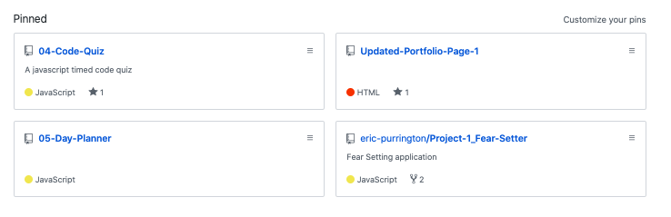
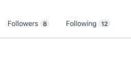

# Updated-Portfolio-Page-1

## Links

1. [Updated Portfolio](https://avaarm.github.io/Updated-Portfolio-Page-1/)
2. [GitHub Profile](https://github.com/avaarm) 
3. [Updated Resume](https://avaarm.github.io/Updated-Portfolio-Page-1/resume.html) 
4. [Updated LinkedIn](https://www.linkedin.com/in/armenuhi-avanesyan-99101286/) 

### Updated Portfolio

The updated site should have the following content:

* Links to your GitHub profile & LinkedIn page as well as your email address and phone number - Did not feel comfortable putting my email address and phone number online. Have provided github and linkedin. 

* A link to a PDF of your resume

* A list of projects. For each project, make sure you have the following:

  * Project title

  * Link to the deployed version

  * Link to the GitHub repository

  * Screenshot of the deployed application

#### Design

* Mobile-first design

* Choose a color palette for your site so it doesn't just look like
the default bootstrap theme or an unstyled HTML site - I chose a transparent background becuase I wanted the page to be simple and easy to read. 

* Make sure the font size is large enough to read, and that the colors don't cause eye strain.

### Updated GitHub Profile 

 * Profile picture - Do not feel as comfortable with a personal photo on github so I have a photo of some ancient stonehenges from Armenia.

 

 * Bio - "An immunology and microbiology researcher currently enrolled in a Full Stack Web development program, hoping to explore a career in technology"

 * Location - Seattle, WA

 * Email - avaarm95@gmail.com

 * Link to your portfolio - [MyPortfolio](https://avaarm.github.io/Updated-Portfolio-Page-1/)

 * Pin some repos that you want to highlight 

 

 * Make sure each of these projects is deployed and add a link to the deployed project in their README files

 * Follow your classmates

  

### Updated Resume 

I am currently unsure of the type of industry I will be entering once I finish this program, so I will be submitting a resume that is a combination of my research background and that of the certificate program. Link to pdf od resume is above in the "Links" category. 